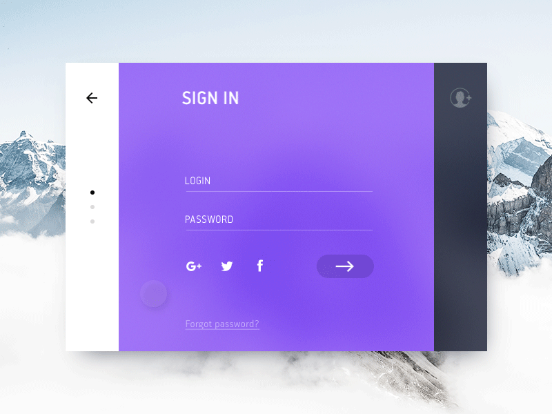

# SignIn/SignUp Form Concept
Simple animated logIn form developed by using ReactJS

[Live Demo](https://fierce-oasis-77300.herokuapp.com/)

Inspired by https://www.uplabs.com/posts/sign-in-and-sign-out

|      Original design      |  Implementation         |
| ------------------------- |:-----------------------:|
| | |

### Instructions
- Clone repository: `git clone https://github.com/NadiKuts/react-signin-form.git`

- Navigate to the created folder: `cd react-signin-form`

- Install dependencies: `npm install`

- Start the project `npm start`

### Sources
React Motion library:

https://github.com/chenglou/react-motion

React Daily UI

https://github.com/fullstackreact/react-daily-ui

### License
MIT License
